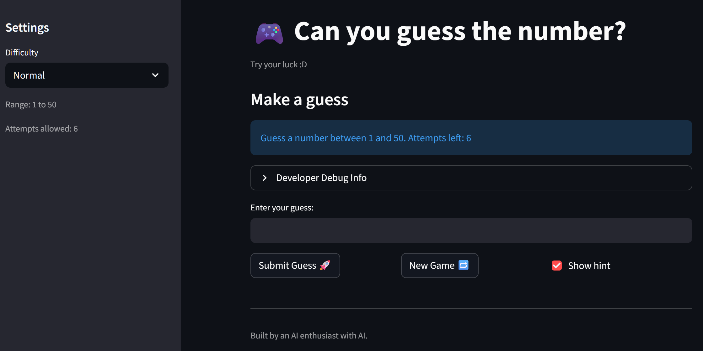
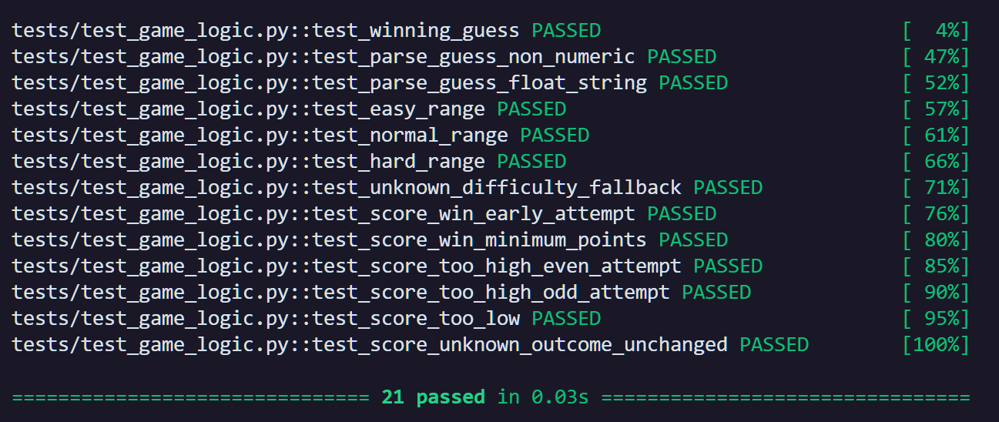

# 🎮 Game Glitch Investigator: The Impossible Guesser

## 🚨 The Situation

You asked an AI to build a simple "Number Guessing Game" using Streamlit.
It wrote the code, ran away, and now the game is unplayable. 

- You can't win.
- The hints lie to you.
- The secret number seems to have commitment issues.

## 🛠️ Setup

1. Install dependencies: `pip install -r requirements.txt`
2. Run the broken app: `python -m streamlit run app.py`

## 🕵️‍♂️ Your Mission

1. **Play the game.** Open the "Developer Debug Info" tab in the app to see the secret number. Try to win.
2. **Find the State Bug.** Why does the secret number change every time you click "Submit"? Ask ChatGPT: *"How do I keep a variable from resetting in Streamlit when I click a button?"*
3. **Fix the Logic.** The hints ("Higher/Lower") are wrong. Fix them.
4. **Refactor & Test.** - Move the logic into `logic_utils.py`.
   - Run `pytest` in your terminal.
   - Keep fixing until all tests pass!

## 📝 Document Your Experience

- [ ] The game is a number guessing game where the user tries to guess a secret number in a range defined by the difficulty level. The user receives hints whether their guess is too high or too low, but the hints are currently incorrect. The secret number also changes every time the user submits a guess, making it impossible to win the game.
- [ ] The bugs I noticed at the start were:
  - The hints for "Higher/Lower" were reversed, meaning if the guess was too high, it would say "Go HIGHER!" and if the guess was too low, it would say "Go LOWER!" which is misleading for the player.
  - The secret number kept changing every time I clicked "Submit Guess," which made it impossible to win the game because the target number was not consistent.
  - The instructions said to "press enter" to submit the guess, but in the app, you had to click the "Submit Guess" button, which was confusing.
  - The "New Game" button didn't start a new game as expected.
- [ ] Explain what fixes you applied.
   - I fixed and refactored the game logic functions from `app.py` and put them in `logic_utils.py`.
   - I fixed the issue with the secret number changing by using Streamlit's session state to store the secret number, ensuring that it persists across reruns of the app when a guess is submitted.
   - I attempted to fix the "Enter" key submission issue by wrapping the input and submit button in a Streamlit form, but this fix did not work as expected.
   - I also fixed the "New Game" button by resetting the session state variables when it is clicked to start a new game properly.

## 📸 Demo

- [ ] 

## 🚀 Stretch Features

- [ ] [If you choose to complete Challenge 4, insert a screenshot of your Enhanced Game UI here]
- [ ] 
